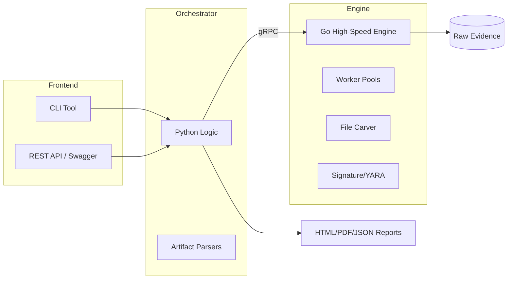

# ⚡ ForenScope v1.0.0

[](https://github.com/ismailtsdln/ForenScope)
[](https://github.com/ismailtsdln/ForenScope/blob/main/LICENSE)
[](https://go.dev/)
[](https://python.org/)

**Professional Hybrid Digital Forensics & Incident Response Platform**

ForenScope is an advanced, high-performance forensic analysis tool designed for deep-dive investigations. By combining **Python's** flexible orchestration with **Go's** blazing-fast raw data processing, ForenScope delivers a modern, extensible, and production-ready forensic experience.

---

## 🚀 Why ForenScope?

In modern forensics, speed and intelligence are non-negotiable. ForenScope bridges the gap between slow, scripted tools and complex, hard-to-extend binary engines.

*   **⚡ Hybrid Engine**: Go handles block-level I/O, heavy hashing, and signature scanning via worker pools. Python manages the intelligent analysis logic and artifact parsing.
*   **🔍 Advanced Artifact Parsing**: Out-of-the-box support for Windows Registry (auto-starts, UserAssist), Browser History (Chrome/Edge/Firefox), and system logs.
*   **🛡️ Malware Intelligence**: Integrated YARA scanner (optional build) for real-time memory and file-system threat hunting.
*   **📂 Precision Carving**: Footer-aware file recovery engine that validates file integrity during extraction.
*   **📊 Narrative Reporting**: Beautiful HTML reports with interactive Vis.js timelines and categorized artifact grids.

---

## 🏗 Modular Architecture

ForenScope follows a clean, hexagonal architecture designed for reliability and maintainability.



---

## 🛠 Quick Start

### 1. Installation

**Prerequisites**: Python 3.10+, Go 1.21+, Protoc (optional for dev).

```bash
# Clone and enter
git clone https://github.com/ismailtsdln/ForenScope.git && cd ForenScope

# Setup Environment
python -m venv venv && source venv/bin/activate
pip install -r requirements.txt

# Build Everything (Requires Makefile)
make all
```

### 2. Basic Usage (CLI)

#### Start the Go Engine (Server)
```bash
./bin/engine
```

#### Run a Signature Scan
```bash
# Scan a directory with 8 workers
python cli/main.py scan --path /mnt/evidence --workers 8
```

#### Carve Evidence from Images
```bash
# Carve files from a raw disk image
python cli/main.py carve --image ./disk_dump.img --output ./recovered_files
```

---

## 🌐 API & Automation

ForenScope is built to be integrated. Start the REST API to manage tasks remotely:

```bash
uvicorn api.main:app
```
Access the interactive documentation at `http://127.0.0.1:8000/docs`.

---

## 📝 Roadmap to v2.0
- [ ] Distributed Engine Support (Multi-node scanning)
- [ ] Deep Memory Image (Volatility-like) integration
- [ ] Native macOS Unified Log support
- [ ] AI-driven anomaly detection in timeline data

---

## 🤝 Contributing & Support

We welcome contributions! Please check our [BUILD.md](docs/BUILD.md) for technical setup and [CONTRIBUTING.md](CONTRIBUTING.md) for workflow details.

**Contact**: ismailtasdelen.pro (via GitHub)

---

## 📄 License

MIT © 2026 Ismail Tasdelen. ForenScope is a registered mark for professional digital forensics.
