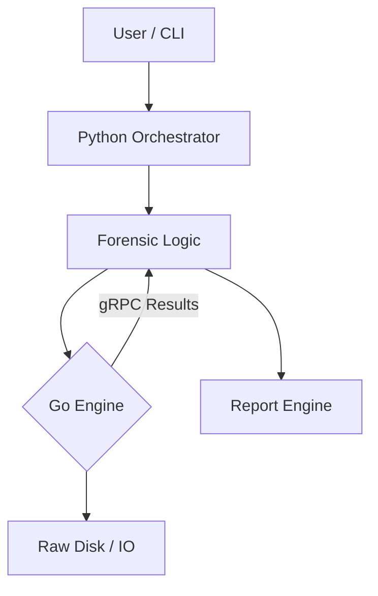

# ForenScope


**Professional Hybrid Digital Forensics Platform**

ForenScope is an advanced, high-performance forensic analysis tool designed for modern incident response. It leverages a unique hybrid architecture: **Python** for intelligent orchestration and parsing, and **Go** for high-speed raw data processing.

---

## 🚀 Key Features

*   **Hybrid Power**: Orchestrated by Python, powered by Go. Best of both worlds.
*   **High Performance Engine**: Parallel disk scanning, carving, and hashing.
*   **Modular Architecture**: Plugin-based system for artifacts and reporting.
*   **Rich CLI Interface**: Beautiful, colored output with tables and progress bars.
*   **Evidence Integrity**: Strict chain-of-custody tracking.
*   **API First**: Fully controllable via REST API or CLI.

## 🏗 Architecture

The system follows a strict **Hexagonal Architecture**:



## 🛠 Installation

### Prerequisites
*   **Python 3.10+**
*   **Go 1.21+**
*   **Protoc** (Protocol Buffers Compiler)

### Build from Source

1.  **Clone the Repository**
    ```bash
    git clone https://github.com/ismailtsdln/ForenScope.git
    cd ForenScope
    ```

2.  **Setup Python Environment**
    ```bash
    python -m venv venv
    source venv/bin/activate
    pip install -r requirements.txt
    ```

3.  **Build the Platform** (Generates Protos + Compiles Go Engine)
    ```bash
    make all
    ```

## 💻 Usage

### 1. Start the Engine
The high-performance engine must be running to process heavy tasks.
```bash
./bin/engine
```

### 2. Run Commands (CLI)
Open a new terminal and run forensic commands.

**Ping the System:**
```bash
python cli/main.py ping
```

**Scan a Directory/Image (Signature Analysis):**
```bash
python cli/main.py scan --image /path/to/evidence --fast
```

**Carve Deleted Files (Header Recovery):**
```bash
python cli/main.py carve --image /path/to/disk.img --output /path/to/recovered
```

### 3. API Server
Start the REST API for remote management.
```bash
uvicorn api.main:app --reload
```
Swagger UI will be available at `http://127.0.0.1:8000/docs`.

## 🛡 Development

### Directory Structure
*   `core/`: Python domain logic.
*   `engine/`: Go logic (Scanning, Hashing).
*   `contracts/`: Protobuf definitions.
*   `orchestrator/`: Client code to talk to Engine.

### Testing
```bash
# Python Tests
pytest

# Go Tests
cd engine && go test ./...
```

## 🤝 Contributing

Contributions are welcome! Please see [CONTRIBUTING.md](CONTRIBUTING.md).

## 📄 License

This project is licensed under the MIT License - see the [LICENSE](LICENSE) file for details.
